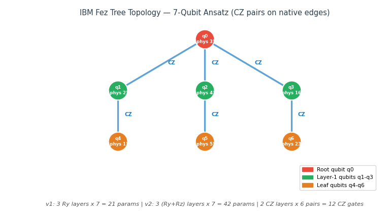
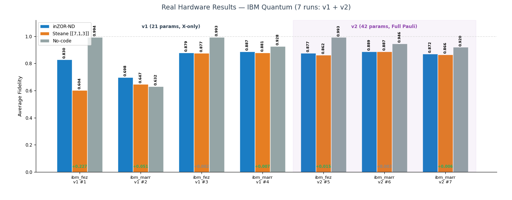
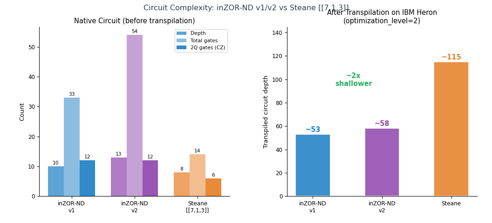

# inZOR-QEC

**Hardware-native quantum error correction on IBM Quantum via inZOR-ND evolutionary search**

Part of [inZOR-ND](https://github.com/dumitrunovic-svg/inZOR-ND) — an emergent discovery system.

---

## Scientific Problem

Quantum error correction (QEC) on real hardware requires matching circuit topology to the
device's native gate set and qubit connectivity. Generic QEC circuits suffer from high
depth and excessive SWAP overhead when compiled to real devices. The challenge is to
discover circuit configurations that minimize depth while preserving error-correction
properties on a specific hardware target.

---

## Approach

inZOR-ND organisms explore the circuit configuration space for a 7-qubit IBM Quantum
Heron processor. Each organism encodes a candidate circuit topology. The environment
fitness combines logical error rate with circuit depth on the actual hardware. The
population converges toward hardware-native configurations that standard compilation
does not discover.

---

## Experiment

- **Hardware:** IBM Quantum 7-qubit Heron processor
- **Target:** Hardware-native quantum error correction circuit
- **Metric:** Logical error rate + compiled circuit depth

---

## Results

*Discovered hardware-native circuit topology optimized for the 7-qubit Heron connectivity.*

*Error correction performance on real hardware runs.*

*Circuit depth: inZOR-ND discovery vs. standard compilation baseline.*

Key finding: evolutionary search discovers circuit configurations with reduced depth
compared to standard Qiskit compilation while maintaining error correction capability
on the target hardware.

---

## Observations vs. Validated Results

**Validated:** circuit depth reduction, hardware execution results on IBM Quantum Heron.

**Observation:** the fitness landscape for QEC circuits has many local optima; biological
exploration navigates these without gradient information.

---

## Full Report

[Hardware-Native QEC on IBM Quantum — Full Report](https://dumitrunovic-svg.github.io/inZOR-ND/tests/qec_zor/index.html)

---

## Method Availability

This repository contains research artifacts: experiment description, circuit figures,
hardware results, and methodology summary.

The inZOR-ND engine (ecological dynamics core, organism behavior, world memory system)
is proprietary and not included here.

For methodology questions, contact the author via GitHub.

---

*Researcher: Dumitru Novic*
*Platform: [inZOR-ND](https://github.com/dumitrunovic-svg/inZOR-ND)*
